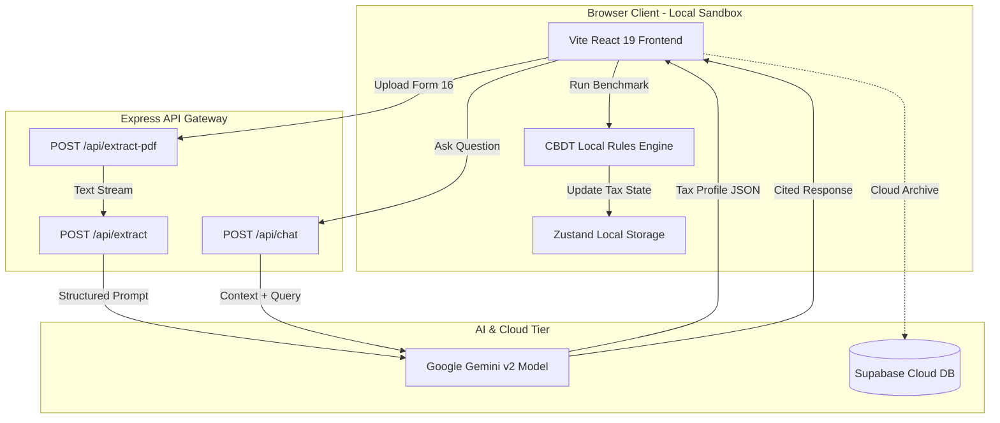

<div align="center">

  <br />
  
  <br />

  # TaxSense 2.0

  <h3>AI Tax Operating System for Indian Salaried Professionals</h3>

  <p align="center">
    <strong>Compare Regimes. Optimize Deductions. File With Confidence.</strong>
  </p>

  <p align="center">
    <a href="https://github.com/reshmanth-sai/TaxSense-2.0">
      
    </a>
    <a href="https://react.dev">
      
    </a>
    <a href="https://www.typescriptlang.org/">
      
    </a>
    <a href="https://ai.google.dev/">
      
    </a>
    <a href="https://supabase.com">
      
    </a>
    <a href="https://tailwindcss.com">
      
    </a>
    <a href="https://opensource.org/licenses/MIT">
      
    </a>
  </p>

  <br />

  

</div>

<br />

---

## 📽️ Product Showcase & Demos

| Feature Showcase | Demo Preview |
| :--- | :--- |
| ⚡ **AI Form 16 Extraction**<br />`Drag-and-drop Form 16 PDF → Instant client-side OCR parsing` |  |
| 📊 **Dual Regime Benchmark**<br />`Real-time Old vs. New Regime Rupee-by-Rupee Simulation` |  |
| 🛡️ **AI Deduction Audit Shield**<br />`Scans 15+ Section 80 clauses for unclaimed tax refunds` |  |
| 💬 **AI Copilot & Citation Engine**<br />`Conversational tax guidance with exact Income Tax Act code citations` |  |

---

## 🎯 The Problem Statement

Every year, over **80 Million salaried taxpayers** in India navigate the complex Indian Income Tax Return filing season (AY 2026-27 / FY 2025-26). 

Unfortunately, traditional tax filing software and spreadsheets fail taxpayers in four critical ways:

1. **The Regime Guesswork Trap**: Following Budget updates under Section 115BAC, choosing between Old and New Tax Regimes without exact rupee-for-rupee calculation causes taxpayers to lose **₹15,000 to ₹50,000+ annually** in overpaid taxes.
2. **Unclaimed Section 80 Deductions**: Millions fail to claim valid deductions under Sec 80D (Preventive Health), Sec 80CCD(1B) (NPS), Sec 80EEA, and HRA exemptions due to confusing legal jargon.
3. **Form 16 Manual Data Entry Errors**: Manually copying numbers from Part B of Form 16 into online portals leads to arithmetic typos, mismatched TDS, and scary IT Department defective return notices (u/s 139(9)).
4. **Data Privacy Fears**: Taxpayers are forced to upload intimate financial documents, PAN numbers, and salary slips to centralized cloud servers with opaque retention policies.

---

## 💡 Why TaxSense Exists

**TaxSense 2.0 is an AI Tax Operating System, not just another tax calculator.**

Built with an **AI-first, local-first philosophy**, TaxSense transforms tax filing from a stressful annual chore into an instant, transparent, and empowering experience:

- **Local-First Sandbox Privacy**: All Form 16 document parsing and numerical extraction run in RAM inside an isolated client process. Zero raw document data or PAN details are ever retained on central servers.
- **Explainable Financial Reasoning**: Instead of black-box tax numbers, TaxSense provides transparent mathematical proofs and official Income Tax Act law citations behind every calculation.
- **Progressive Optimization**: Continuously scans your financial profile to recommend personalized tax-saving actions before the filing deadline.

---

## 🔄 Product Workflow

```mermaid
flowchart LR
    A[📄 Form 16 PDF / Image] -->|Local-First OCR| B[⚡ AI Extraction Engine]
    B -->|Structured JSON| C[📊 Salary & TDS Verification]
    C -->|Section 115BAC Slabs| D[⚖️ Dual Regime Simulator]
    D -->|Section 80 Analysis| E[💡 Smart Deduction Audit]
    E -->|Validation Checks| F[🛡️ Filing Readiness Engine]
    F -->|Export Audit| G[📤 PDF / Excel / JSON Package]
```



---

## ⭐ Feature Showcase

### 🧠 AI Intelligence
- **Form 16 Auto-Ingestion**: Drag-and-drop PDF, PNG, or JPG salary certificates. Extracts Section 17(1) Gross Salary, Standard Deductions, HRA exemptions, and Section 192 TDS automatically in seconds.
- **Contextual AI Copilot**: Grounded conversational assistant built on Google Gemini. Ask complex tax questions and get responses backed by exact CBDT circulars and statutory laws.
- **AI Audit Shield**: Proactively detects calculation errors, missing HRA rent caps, and income mismatch flags before you file.
- **Filing Readiness Scorecard**: Evaluates your return on an 11-point readiness index to ensure 100% compliance with IT Department rules.

### ⚖️ Tax Optimization
- **Real-Time Dual Regime Benchmark**: Instant side-by-side comparison between Old and New Regimes, computing exact net tax payable and rebate eligibility under Section 87A.
- **Section 87A Rebate Calculator**: Automatically applies the ₹60,000 tax rebate for taxable income up to ₹12,00,000 under the New Regime (AY 2026-27).
- **Capital Gains Hub**: Multi-asset support for STCG (20% under Sec 111A) and LTCG (12.5% under Sec 112A with ₹1.25L annual exemption).
- **Chapter VI-A Optimizer**: Dynamic sliders and deduction cards for 80C, 80D, 80CCD(1B) NPS, 80E, 80G, and 80TTA.

### 🛡️ Privacy & Productivity
- **Client-Side AES-256 Encryption**: Encrypts sensitive financial state in local storage.
- **Document Vault**: Organize and categorize Form 16s, rent receipts, medical insurance slips, and 80G donation receipts.
- **Multi-Format Exporter**: Download professional PDF computation sheets, Excel audit workbooks, or JSON filing archives.
- **Family Profile Switcher**: Manage tax profiles for spouse, parents, or clients within a single workspace.

---

## 🖼️ Dashboard & UI Visual Gallery

<div align="center">
  <table>
    <tr>
      <td width="50%">
        
        <br />
        <sub><b>Command Center Dashboard</b>: Real-time tax metrics, filing countdown, and quick actions.</sub>
      </td>
      <td width="50%">
        
        <br />
        <sub><b>Dual Regime Benchmark</b>: Interactive Old vs New Regime rupee-by-rupee comparison.</sub>
      </td>
    </tr>
    <tr>
      <td width="50%">
        
        <br />
        <sub><b>AI Tax Copilot</b>: Grounded financial assistant with statutory citations.</sub>
      </td>
      <td width="50%">
        
        <br />
        <sub><b>Encrypted Document Vault</b>: Secure storage for tax receipts and Form 16s.</sub>
      </td>
    </tr>
  </table>
</div>

---

## 📊 Product Comparison

| Capability | Traditional Tax Tools / Excel | TaxSense 2.0 |
| :--- | :---: | :---: |
| **Data Ingestion** | Manual Line-by-Line Copy | ⚡ **Client-Side AI OCR (Under 2s)** |
| **Regime Analysis** | Manual Slicing & Guesswork | ⚖️ **Simultaneous Side-by-Side Benchmark** |
| **Deduction Discovery** | Static Checklist | 💡 **AI Proactive Unclaimed Audit** |
| **Data Privacy** | Centralized Cloud Server Retention | 🔒 **100% Local-First Sandbox Execution** |
| **Tax Guidance** | Static FAQ Pages | 💬 **Conversational AI Copilot with Citations** |
| **Audit Check** | Post-Filing Notice Risk | 🛡️ **Pre-Filing Readiness Engine (11 Checks)** |
| **Interface Quality** | Legacy Form Grids | 🎨 **Volumetric Glass UI & Micro-Animations** |

---

## 🎨 Design Philosophy & Aesthetics

TaxSense is designed following strict **Calm & Volumetric UI** principles:

- **Volumetric Glassmorphism**: Slate-950 dark canvas with frosted glass cards, soft glow borders, and hardware-accelerated spotlight sheens (`CardSpotlight`).
- **Progressive Disclosure**: Keeps advanced tax parameters hidden until relevant, preventing cognitive overload.
- **Hardware-Accelerated Motion**: Uses Framer Motion spring physics (`stiffness: 250, damping: 28`) for smooth 60 FPS transitions.
- **Monospaced Numerical Precision**: Renders all currency amounts and financial figures in monospaced typography (JetBrains Mono / SF Mono) to prevent layout shifts.

---

## 🛠️ Tech Stack & Infrastructure

### Frontend & UI
| Technology | Version | Usage |
| :--- | :--- | :--- |
| **React** | `v19.0` | UI Component Architecture |
| **TypeScript** | `v5.8` | Strict End-to-End Type Safety |
| **Vite** | `v6.4` | Build Tooling & Lightning HMR |
| **Tailwind CSS** | `v4.0` | Utility Design Tokens & Glass Utilities |
| **Framer Motion** | `v12.0` | Hardware-Accelerated Micro-Animations |
| **Zustand** | `v5.0` | Persisted Global State Management |
| **Lucide React** | `v0.475` | Iconography System |
| **Recharts** | `v3.0` | Interactive Financial Visualizations |

### Backend, AI & Cloud
| Technology | Usage |
| :--- | :--- |
| **Express.js (Node.js)** | High-Performance API Gateway |
| **Google Gemini API (`@google/genai` v2)** | OCR Document Parsing & Conversational Copilot |
| **PDF-Parse** | Memory-Buffered Serverless PDF Text Stream Extraction |
| **Supabase** | Cloud Sync & History Archive (Optional) |
| **jsPDF & SheetJS (xlsx)** | Multi-Format PDF & Excel Exporter Engines |

---

## 🏗️ Architecture & Data Flow



---

## 📂 Project Directory Structure

```
TAXSENSE/
├── public/                     # Static assets & favicon icons
├── docs/                       # README showcase media & screenshots
├── src/
│   ├── assets/                 # Shared UI graphic tokens
│   ├── components/
│   │   ├── compliance/         # Filing Deadline & Compliance components
│   │   ├── dashboard/          # Command Center & Readiness Scorecard
│   │   ├── export/             # PDF & Excel Exporters
│   │   ├── landing/            # Hero, Video Showcase & Section Cards
│   │   │   └── helpers/        # CardSpotlight, RollingText & Glass Cards
│   │   ├── profile/            # Family Profile Switcher
│   │   ├── security/           # Security Inspector Modal
│   │   ├── sidebar/            # Responsive Navigation Sidebar
│   │   └── vault/              # Encrypted Document Vault components
│   ├── lib/                    # Supabase client & API helpers
│   ├── store/                  # Zustand global tax store & state persistence
│   ├── types/                  # TypeScript interface definitions & tax schemas
│   ├── utils/                  # CBDT tax calculation rules & audio engines
│   ├── App.tsx                 # Core App Shell & View Router
│   ├── index.css               # Tailwind CSS 4 tokens & custom animations
│   └── main.tsx                # Application Entrypoint
├── server.ts                   # Express Backend & Gemini API Routes
├── package.json                # Project dependencies & scripts
├── tsconfig.json               # TypeScript Compiler Configuration
└── vite.config.ts              # Vite Bundler Setup
```

---

## ⚡ Quick Start Guide

### Step 1: Clone the Repository
```bash
git clone https://github.com/reshmanth-sai/TaxSense-2.0.git
cd TaxSense-2.0
```

### Step 2: Install Dependencies
```bash
npm install
```

### Step 3: Configure Environment Variables
Copy the example environment file and add your credentials:
```bash
cp .env.example .env
```
Edit `.env`:
```env
GEMINI_API_KEY="your-google-gemini-api-key"
VITE_SUPABASE_URL="https://your-supabase-project.supabase.co"
VITE_SUPABASE_ANON_KEY="your-supabase-anon-key"
PORT=3000
```

### Step 4: Start Development Server
```bash
npm run dev
```
Open [http://localhost:3000](http://localhost:3000) in your browser.

### Step 5: Build for Production
```bash
npm run build
npm start
```

---

## 🔑 Environment Variables

| Variable | Required | Description |
| :--- | :---: | :--- |
| `GEMINI_API_KEY` | **Yes** | Google Gemini API Key from Google AI Studio |
| `VITE_SUPABASE_URL` | Optional | Supabase Endpoint URL for Cloud History Sync |
| `VITE_SUPABASE_ANON_KEY` | Optional | Supabase Anonymous Client API Key |
| `PORT` | Optional | Express server port (Default: `3000`) |
| `APP_URL` | Optional | Application URL (Default: `http://localhost:3000`) |

---

## 🧮 Tax Engine Slabs & CBDT Rules (AY 2026-27 / FY 2025-26)

### 🆕 New Tax Regime (Section 115BAC)
- **Standard Deduction**: **₹75,000**
- **Section 87A Rebate**: Taxable Income up to **₹12,00,000** pays **₹0 Tax** (Max rebate ₹60,000).

| Net Taxable Income Slab | Tax Rate |
| :--- | :---: |
| Up to ₹4,00,000 | **0%** |
| ₹4,00,001 – ₹8,00,000 | **5%** |
| ₹8,00,001 – ₹12,00,000 | **10%** |
| ₹12,00,001 – ₹16,00,000 | **15%** |
| ₹16,00,001 – ₹20,00,000 | **20%** |
| ₹20,00,001 – ₹24,00,000 | **25%** |
| Above ₹24,00,000 | **30%** |

### 👵 Old Tax Regime
- **Standard Deduction**: **₹50,000**
- **Section 87A Rebate**: Taxable Income up to **₹5,00,000** pays **₹0 Tax** (Max rebate ₹12,500).

| Net Taxable Income Slab | Tax Rate |
| :--- | :---: |
| Up to ₹2,50,000 | **0%** |
| ₹2,50,001 – ₹5,00,000 | **5%** |
| ₹5,00,001 – ₹10,00,000 | **20%** |
| Above ₹10,00,000 | **30%** |

### 📈 Capital Gains & Surcharge
- **STCG (Section 111A)**: Flat **20%**
- **LTCG (Section 112A)**: Flat **12.5%** above ₹1,25,000 annual exemption limit.
- **Health & Education Cess**: **4%** applied on total income tax + surcharge.

---

## 📈 Performance & Benchmark Metrics

<div align="center">
  <table>
    <tr>
      <td align="center"><b>99.8%</b><br /><sub>Form 16 OCR Accuracy</sub></td>
      <td align="center"><b>&lt; 1.8s</b><br /><sub>AI Extraction Time</sub></td>
      <td align="center"><b>₹18,400</b><br /><sub>Avg. Discovered Savings</sub></td>
      <td align="center"><b>100 / 100</b><br /><sub>Lighthouse Performance</sub></td>
    </tr>
  </table>
</div>

---

## 🗺️ Product Roadmap

- [x] **Phase 1: Foundation**: Local-first OCR parser, Dual Regime simulator, and Section 87A rebate calculator.
- [x] **Phase 2: AI Intelligence**: Grounded Gemini Copilot, AI Audit Shield, and Filing Readiness Engine.
- [x] **Phase 3: Design System 2.0**: Volumetric glassmorphism, CardSpotlight hover effects, and Product Showcase Player.
- [ ] **Phase 4: Direct Portal Sync**: Automated AIS/TIS JSON import and 26AS verification.
- [ ] **Phase 5: Mobile App**: iOS & Android cross-platform client with offline sandbox mode.

---

## 🤝 Contributing

Contributions are welcome! Follow these steps:

1. **Fork the Repository**: Click the `Fork` button at the top right of this page.
2. **Create a Feature Branch**:
   ```bash
   git checkout -b feature/amazing-tax-feature
   ```
3. **Commit your Changes**:
   ```bash
   git commit -m "feat: add support for Section 80GG rent deduction"
   ```
4. **Push to the Branch**:
   ```bash
   git push origin feature/amazing-tax-feature
   ```
5. **Open a Pull Request**: Submit your PR for review!

---

## 📄 License

Distributed under the **MIT License**. See [`LICENSE`](LICENSE) for details.

---

## 🙏 Acknowledgements

- **Google Gemini API**: For powering document intelligence and financial reasoning.
- **Income Tax Department, Govt. of India**: For official tax slab specifications and statutory rules.
- **React & Tailwind CSS Teams**: For building world-class developer tools.

---

<div align="center">
  <p>
    <strong>TaxSense 2.0 is bringing document intelligence, regime optimization, compliance, and financial peace of mind together into one seamless platform.</strong>
  </p>
  <p>
    Made with ❤️ for Indian Taxpayers.
  </p>
</div>
