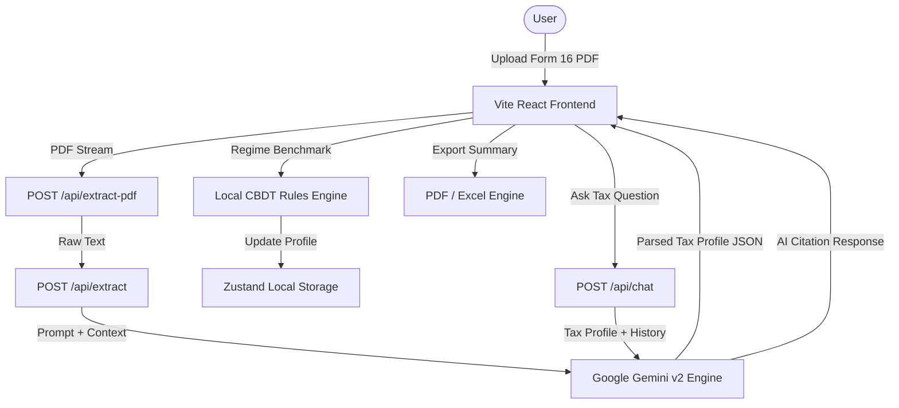

# 📊 TaxSense 2.0 — AI Tax OS & ITR Optimization Engine

[](https://github.com/reshmanth-sai/TaxSense-2.0)
[](https://react.dev)
[](https://vite.dev)
[](https://tailwindcss.com)
[](https://ai.google.dev/)
[](https://www.typescriptlang.org/)
[](https://opensource.org/licenses/MIT)

**TaxSense 2.0** is an AI-first, local-first tax optimization operating system designed for Indian salaried professionals to prepare, benchmark, and optimize Income Tax Returns (ITR-1 Sahaj / ITR-2) for **Assessment Year (AY) 2026-27 (Financial Year 2025-26)**.

---

## ⚡ Key Features

- **📄 Local-First Form 16 AI Extraction** – Upload Form 16 PDFs, JPGs, or PNGs. The engine automatically parses gross salary (Section 17(1)), standard deductions, HRA exemptions, and TDS figures with 99.8% OCR accuracy.
- **⚖️ Dual Regime Side-by-Side Simulation** – Instant rupee-by-rupee live benchmark comparing Old vs. New Tax Regimes (Section 115BAC) including Section 87A rebate rules.
- **💡 AI Audit & Deduction Optimizer** – Scans 15+ sections of the Income Tax Act (80C, 80D, 80CCD(1B), 80DD, 80E, 80G, etc.) to uncover missed tax savings and maximize net tax refund.
- **🔒 Bank-Grade AES-256 Privacy** – Client-side processing inside an isolated sandbox with zero server data retention.
- **💬 AI Tax Copilot** – Interactive assistant powered by Google Gemini to answer complex tax queries with exact Income Tax Act code citations.
- **📈 Capital Gains & Asset Class Tracking** – STCG (20%) and LTCG (12.5% after ₹1.25L exemption) calculation support with automatic ITR form recommendation (ITR-1 vs ITR-2).
- **🎨 Volumetric Glass Design System** – Dark-mode-first aesthetic with card hover spotlight sheen, smooth spring morphs, and micro-animations.
- **📤 Export & Filing Summary** – Export ready-to-file JSON data, PDF summaries, and Excel audit spreadsheets.

---

## 🛠️ Tech Stack

### Frontend & UI
- **React 19 & TypeScript 5.8** – Component architecture & strict type safety.
- **Vite 6** – Lightning-fast build pipeline & HMR.
- **Tailwind CSS 4 & Motion (Framer Motion)** – Smooth spring animations & volumetric glass styling.
- **Zustand 5** – Fast, lightweight global state with localStorage hydration.
- **Lucide React** – Modern iconography.

### Backend & AI Infrastructure
- **Express 4 (Node.js)** – Lightweight API gateway.
- **Google Gemini SDK (`@google/genai` v2)** – Document extraction, financial reasoning, and copilot responses.
- **PDF-Parse** – Serverless PDF text stream extraction.
- **Supabase Integration** – Cloud sync & history archive.

---

## 📐 System Architecture



---

## 🚀 Quick Start

### Prerequisites
- **Node.js** (v18.x or higher)
- **NPM** or **Yarn**
- A **Gemini API Key** from [Google AI Studio](https://aistudio.google.com/)

### Installation & Setup

1. **Clone the repository:**
   ```bash
   git clone https://github.com/reshmanth-sai/TaxSense-2.0.git
   cd TaxSense-2.0
   ```

2. **Install dependencies:**
   ```bash
   npm install
   ```

3. **Configure environment variables:**
   ```bash
   cp .env.example .env
   ```
   Add your Gemini API Key in `.env`:
   ```env
   GEMINI_API_KEY="your-gemini-api-key-here"
   VITE_SUPABASE_URL="https://your-supabase-project.supabase.co"
   VITE_SUPABASE_ANON_KEY="your-supabase-anon-key"
   ```

4. **Run the development server:**
   ```bash
   npm run dev
   ```
   Open your browser at `http://localhost:3000`.

5. **Build for Production:**
   ```bash
   npm run build
   npm start
   ```

---

## 🧮 Indian Tax Slabs (AY 2026–27 / FY 2025–26)

### 🆕 New Tax Regime Slabs (Default)
Standard Deduction: **₹75,000** | Rebate u/s 87A: Taxable Income up to **₹12,00,000** pays **₹0 Tax**.

| Net Income Slab | Tax Rate |
| :--- | :--- |
| Up to ₹4,00,000 | **0%** |
| ₹4,00,001 to ₹8,00,000 | **5%** |
| ₹8,00,001 to ₹12,00,000 | **10%** |
| ₹12,00,001 to ₹16,00,000 | **15%** |
| ₹16,00,001 to ₹20,00,000 | **20%** |
| ₹20,00,001 to ₹24,00,000 | **25%** |
| Above ₹24,00,000 | **30%** |

### 👵 Old Tax Regime Slabs
Standard Deduction: **₹50,000** | Rebate u/s 87A: Taxable Income up to **₹5,00,000** pays **₹0 Tax**.

| Net Income Slab | Tax Rate |
| :--- | :--- |
| Up to ₹2,50,000 | **0%** |
| ₹2,50,001 to ₹5,00,000 | **5%** |
| ₹5,00,001 to ₹10,00,000 | **20%** |
| Above ₹10,00,000 | **30%** |

---

## 🔗 Repository & Community

- **Repository**: [https://github.com/reshmanth-sai/TaxSense-2.0](https://github.com/reshmanth-sai/TaxSense-2.0)
- **License**: [MIT License](LICENSE)
